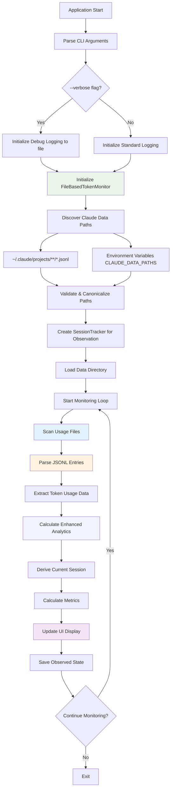

# Claude Token Monitor - File-Based Edition

🧠 **v0.2.6** - A lightweight, high-performance Rust tool for monitoring Claude AI token usage by reading local files created by Claude Code.

## Features

- 📁 **File-based monitoring** - No API keys or authentication required
- 🔍 **Passive observation** - Reads Claude Code's JSONL usage files
- 📊 **Enhanced Ratatui UI** with 7 interactive tabs and dual view modes
- 🎯 **Advanced Analytics** - Cache metrics, real-time dashboards, and time-series charts
- 🔄 **Dual Overview Modes** - General and Detailed views with comprehensive session analytics
- 🤖 **Smart predictions** for token depletion timing based on observed usage
- 📈 **Usage analytics** and efficiency scoring from real usage data
- 🔄 **Session observation** with persistent storage of observed sessions
- ⚡ **Lightning fast** - built with Rust for performance and memory safety
- 🛠️ **Configurable** plans and thresholds
- 📱 **Cross-platform** support (Linux, macOS, Windows)
- 🔒 **Privacy-focused** - All processing happens locally, no network connections
- 🕐 **Human-friendly time formatting** using humantime library
- ⚙️ **Real-time file watching** for automatic updates when Claude Code writes new data
- 📝 **Advanced Logging** - Verbose debug mode with file output for troubleshooting
- 🔧 **Debug Mode** - Comprehensive debugging tools for input handling and UI issues

## How It Works

This tool monitors your Claude AI token usage by **passively reading local files** that Claude Code writes during your conversations. It requires **no API calls, authentication, or network access** - everything happens locally by observing the usage data Claude Code already creates.

#### Observations by the author:
This is a work in progress that aspires to offer insight into at least what the token burn rate is however there are many factors to consider given all the optimizations and caching going on - in other words, YMMV!

Things at play:
- Estimating token usage appears to be complex. 
- Caching, tokens sent, tokens received, concurrent sessions,  time of day behaviours by Claude that may be lienent OR more strict when load is high are all factors
- What this tool does is report on it's observations and gives an estimation of usage and glimpse into the Claude project JSONL files it has.
- the 'plan' is an inferrence/hint given all the above


### What Files It Monitors

- `~/.claude/projects/**/*.jsonl` (primary location)
- `~/.config/claude/projects/**/*.jsonl` (alternative location)  
- Custom paths from `CLAUDE_DATA_PATHS` or `CLAUDE_DATA_PATH` environment variables

### What Data It Reads

- Token usage counts (input, output, cache creation, cache read tokens)
- Timestamps of each Claude interaction
- Model information and session identifiers
- Request and message IDs (for deduplication)
- Cache hit rates and creation patterns
- Token consumption efficiency metrics

The tool reads token usage metadata that Claude Code logs and recommend you review what Claude is logging.

## Installation

### Prerequisites

1. **Claude Code** must be installed and configured
2. **Rust** toolchain (if building from source)

### From Source

1. Install Rust (if not already installed):
```bash
curl --proto '=https' --tlsv1.2 -sSf https://sh.rustup.rs | sh
```

2. Clone and build:
- This branch is v0.2.6-maintenance however intention is to merge it down to main post release. Use the binary install is recommended.
Main branch:
```bash
git clone https://github.com/teamktown/claude-token-monitor
cd claude-token-monitor
cargo build --release
```

3. Install globally:
```bash
cargo install --path .
```

## Usage

### Quick Start

1. **Use Claude Code** to have a conversation (this creates the usage files)
2. **Start monitoring** with enhanced Ratatui interface:
```bash
claude-token-monitor
```

For basic terminal UI:
```bash
claude-token-monitor --basic-ui
```

For development/testing with mock data:
```bash
claude-token-monitor --force-mock
```

For verbose debugging with file logging:
```bash
claude-token-monitor --verbose
```

### Commands

#### Monitor in Real-time (Passive Observation)
```bash
# Start monitoring with Pro plan (uses Ratatui interface by default)
claude-token-monitor monitor --plan pro

# Monitor with verbose logging
claude-token-monitor monitor --plan max5 --verbose

# Monitor with custom update interval  
claude-token-monitor monitor --plan max5 --interval 5

# Use basic terminal UI instead of Ratatui
claude-token-monitor monitor --basic-ui

# Default monitoring (same as 'monitor' command)
claude-token-monitor
```

#### Session Observation (Read-Only)
```bash
# Check observed session status from JSONL files
claude-token-monitor status

# View observed session history
claude-token-monitor history --limit 20
```

#### Configuration
```bash
# Set default plan hint for calculations
claude-token-monitor config --plan max20

# Set update interval for file scanning
claude-token-monitor config --interval 2

# Set warning threshold (85% = 0.85)
claude-token-monitor config --threshold 0.9
```

#### Information and Help
```bash
# Get detailed explanation of how the tool works
claude-token-monitor --explain-how-this-works

# Show version and author information
claude-token-monitor --about

# Get help with all commands
claude-token-monitor --help
```

### Plan Types

- **pro**: 40,000 tokens per 5-hour session
- **max5**: 20,000 tokens per 5-hour session  
- **max20**: 100,000 tokens per 5-hour session
- **custom**: Specify custom token limit (e.g., `--plan 50000`)

**Note:** Plan types specified via CLI are **hints for calculations** when no usage data is available. The tool automatically detects your actual plan type from observed usage patterns and will override CLI hints when sufficient data exists. Plan type switches are detected by analyzing token consumption patterns over time.

## Enhanced Ratatui Interface

The enhanced interface provides 7 interactive tabs with comprehensive monitoring:

### Tab 0: Overview (Dual View Mode)

**NEW in v0.2.6:** Toggle between General and Detailed views using the **'V'** key!

#### General View (Simple)
- Real-time observed session information with status indicators
- Time-series strip chart showing cumulative token usage over time
- Session predictions and recommendations

#### Detailed View (Advanced Analytics)
- **Real-time Metrics Dashboard** with 4-panel layout:
  - **Token Consumption**: Rate (tokens/min) and Input/Output ratio
  - **Cache Analytics**: Hit rate percentage and cache creation rate
  - **Session Progress**: Progress percentage and remaining tokens
  - **Efficiency**: Efficiency score and projected depletion time
- **Stacked Time-Series Chart** with multiple token type datasets:
  - Total tokens (green line)
  - Input tokens (blue line)  
  - Output tokens (yellow line)
- **Enhanced JSONL File Display** showing monitored file patterns

### Tab 1: Charts  
- Token usage distribution (used vs remaining) with horizontal bar charts
- Usage history visualization with time-based progression
- Visual representation of token consumption patterns

### Tab 2: Session
- Detailed observed session information (ID, plan, dates)
- Session predictions with depletion timing
- Usage efficiency recommendations based on patterns

### Tab 3: Details (Interactive)
- Navigable detail categories with drill-down capability
- Token breakdown, usage rate analysis, session timeline
- Cache token details, model information, file sources
- Performance metrics and recent activity summaries

### Tab 4: Security
- Security recommendations and analysis
- Memory safety, input validation, and resource protection status
- Information security and build security features

### Tab 5: Settings
- Current configuration display
- Technical details about passive monitoring data flow
- File operation explanations and calculation formulas

### Tab 6: About
- Author and version information
- Usage tips and Claude Code integration details
- Attribution and build information

**Navigation:**
- `Tab` / `N` / `Shift+Tab`: Switch between tabs
- `V`: Toggle Overview view mode (General ↔ Detailed) - **NEW!**
- `q` / `Esc` / `Ctrl+C`: Quit application  
- `r`: Refresh data (rescans files)
- `↑↓`: Scroll within tabs
- `←→`: Navigate details (Tab 3 only)

## Advanced Analytics Features (v0.2.6)

### Cache Metrics Tracking
- **Cache Hit Rate**: Percentage of cache read tokens vs total input tokens
- **Cache Creation Rate**: Cache creation tokens per minute
- **Cache Efficiency**: Real-time analysis of cache utilization patterns

### Enhanced Session Analytics
- **Token Consumption Rate**: Real-time tokens per minute tracking
- **Input/Output Ratio**: Analysis of conversation efficiency
- **Session Progress**: Advanced progress tracking with predictive analytics
- **Efficiency Scoring**: Comprehensive efficiency metrics based on usage patterns
- **Plan Type Detection**: Automatic detection of Claude plan types from usage patterns
- **Plan Change Tracking**: Detection of plan upgrades/downgrades based on consumption shifts

### Time-Series Visualization
- **Stacked Charts**: Multiple token type datasets overlaid on time progression
- **Real-time Updates**: Charts update automatically as new JSONL entries are detected
- **Performance Optimization**: Data sampling for large datasets maintains responsive UI

## Debugging and Logging

### Verbose Mode
Enable comprehensive debugging with file-based logging:

```bash
# Enable verbose logging (writes to debug.log)
claude-token-monitor --verbose
```

When `--verbose` is enabled:
- **Debug-level logging** to `debug.log` file
- **Detailed key event tracking** for UI troubleshooting
- **Tab switching diagnostics** for navigation issues
- **File monitoring operations** logged with timestamps
- **Cache metrics calculations** with detailed analytics
- **Session derivation logic** tracking
- **Plan type detection** with usage pattern analysis
- **Plan change detection** with timestamp logging

### Debug Features
- **Comprehensive key event logging** with code, modifiers, and current tab state
- **Tab switching debugging** with before/after state tracking
- **Alternative navigation keys** (`N` key as backup for Tab)
- **Input handling diagnostics** for troubleshooting UI responsiveness
- **Main loop iteration tracking** with exit condition monitoring

### Log File Location
- Debug logs are written to `debug.log` in the current working directory
- Normal operation logs (info/warn/error) continue to stderr
- Log files include timestamps and structured debugging information

## File Discovery and Configuration

### Automatic File Discovery

The monitor automatically discovers Claude Code usage files from these locations:

```bash
# Primary location (most common)
~/.claude/projects/**/*.jsonl

# Alternative location  
~/.config/claude/projects/**/*.jsonl
```

### Custom Paths

You can specify custom paths using environment variables:

```bash
# Multiple paths (colon-separated)
export CLAUDE_DATA_PATHS="/path/to/claude/data:/another/path"

# Single path
export CLAUDE_DATA_PATH="/custom/claude/data"
```

### Security and Validation

All file paths are automatically:
- **Validated** for security (no path traversal, null bytes, etc.)
- **Canonicalized** to resolve symlinks and normalize paths  
- **Bounded** to safe directories (home directory or allowed system paths)
- **Size-limited** to prevent resource exhaustion (50MB max per file)

## Configuration

Configuration is stored in:
- Linux: `~/.local/share/claude-token-monitor/config.json`
- macOS: `~/Library/Application Support/claude-token-monitor/config.json`
- Windows: `%APPDATA%\claude-token-monitor\config.json`

Example configuration:
```json
{
  "default_plan": "Pro",
  "timezone": "UTC",
  "update_interval_seconds": 3,
  "warning_threshold": 0.85,
  "auto_switch_plans": true,
  "color_scheme": {
    "progress_bar_full": "green",
    "progress_bar_empty": "gray",
    "warning_color": "yellow",
    "success_color": "green",
    "error_color": "red",
    "info_color": "blue"
  }
}
```

## Architecture

The tool is built with a modular, file-based monitoring architecture:

```
src/
├── main.rs              # CLI interface and command handling
├── lib.rs               # Library exports
├── models/
│   └── mod.rs          # Data structures (TokenSession, UsageMetrics, etc.)
├── services/
│   ├── mod.rs          # Service traits and interfaces  
│   ├── session_tracker.rs   # Session observation and persistence
│   ├── token_monitor.rs     # Real-time monitoring logic
│   └── file_monitor.rs      # File-based JSONL parsing and analysis
└── ui/
    ├── mod.rs          # Basic terminal UI interface
    └── ratatui_ui.rs   # Enhanced 7-tab Ratatui interface
```

### Key Design Principles

- **Passive Monitoring**: Only reads existing files, never writes to Claude Code data
- **No Network Access**: Everything happens locally, no API calls required
- **Security First**: Comprehensive input validation and memory safety
- **Real-time Updates**: File system watching for immediate updates
- **Privacy Focused**: No conversation content access, only token metadata
- **Advanced Analytics**: Cache metrics and efficiency tracking
- **Debugging Support**: Comprehensive logging and diagnostic tools

## System Flow

The application follows a file-based passive monitoring flow:



For detailed technical flow diagrams, see [docs/system-flow.md](docs/system-flow.md).

### Key Components

- **TokenSession**: Represents an observed Claude usage session with metadata
- **SessionTracker**: Observes and persists session data from JSONL files
- **FileBasedTokenMonitor**: Scans and parses Claude Code's JSONL usage files
- **TokenMonitor**: Real-time monitoring with async file watching
- **RatatuiTerminalUI**: Enhanced 7-tab interface with dual view modes
- **UsageEntry**: Represents individual token usage events from JSONL data
- **UsageMetrics**: Enhanced metrics with cache analytics and efficiency tracking

## Performance

Built with Rust for maximum performance:
- **Memory efficient**: Minimal memory footprint with optimized data structures
- **Fast startup**: Sub-second initialization with intelligent caching
- **Concurrent**: Async/await for non-blocking operations
- **Cross-platform**: Works on Linux, macOS, and Windows
- **Real-time updates**: Efficient polling with configurable intervals
- **Responsive UI**: 50ms refresh rate with data sampling for large datasets

## Development

### Building

```bash
cargo build
```

### Testing

```bash
cargo test
```

### Linting

```bash
cargo clippy
```

### Formatting

```bash
cargo fmt
```

### Check compilation

```bash
cargo check
```

### Debug Mode Development

```bash
# Run with verbose debugging
cargo run --release -- --verbose

# Test tab switching with debug output
cargo run --release -- --verbose 2> debug_output.log

# Monitor debug log in real-time
tail -f debug.log
```

## File Monitoring Features

The monitor includes comprehensive file-based monitoring with:

- **Real-time file watching** using the notify crate for instant updates
- **JSONL parsing** with security limits (1MB per line, 32 levels max depth)
- **Automatic deduplication** based on message IDs and request IDs
- **Session derivation** from usage patterns (5-hour windows)
- **Multi-path support** for different Claude Code installation locations
- **Enhanced analytics** with cache metrics and efficiency tracking

## Mock Mode

For development and testing when no Claude Code data is available:
```bash
claude-token-monitor --force-mock
```

This generates realistic simulated usage data for development purposes, including:
- **Mock cache metrics** with randomized hit rates and creation patterns
- **Realistic token consumption** patterns for testing analytics
- **Time-series data** for chart visualization testing

The application no longer automatically falls back to mock mode - it must be explicitly enabled.

## Contributing

1. Fork the repository
2. Create a feature branch
3. Make your changes
4. Add tests for new functionality
5. Run `cargo test` and `cargo clippy`
6. Submit a pull request

## License

MIT License - see LICENSE file for details.

## Changelog

### v0.2.6 (Current)
- 🎯 **Dual Overview Modes** - Toggle between General and Detailed views with 'V' key
- 📊 **Advanced Analytics Dashboard** - Cache metrics, real-time dashboards, 4-panel layout
- 📈 **Enhanced Time-Series Charts** - Stacked datasets with multiple token types
- 🔍 **Cache Metrics Tracking** - Hit rate, creation rate, and efficiency analytics
- 📝 **Verbose Logging Mode** - Debug logging to file with --verbose flag
- 🔧 **Comprehensive Debugging** - Key event tracking, tab switching diagnostics
- ⚡ **Performance Optimizations** - Data sampling for large datasets, responsive UI
- 🎨 **UI Enhancements** - Alternative navigation keys, improved error handling
- 🛡️ **Enhanced Security** - Improved input validation and path canonicalization

### v0.2.5
- 📁 **File-based monitoring architecture** - Complete rewrite for passive observation
- 🔍 **JSONL file parsing** - Reads Claude Code's usage files directly
- 🛡️ **Security hardening** - Comprehensive input validation and memory safety
- 📊 **7-tab Ratatui interface** - Overview, Charts, Session, Details, Security, Settings, About
- ⚡ **Real-time file watching** - Automatic updates when Claude Code writes new data
- 🔒 **Privacy-focused design** - No network access, all processing local

### v0.2.3-0.2.4
- 🔧 Removed automatic fallback to mock mode (now requires --force-mock)
- 📋 Enhanced Settings tab with comprehensive technical documentation
- 📊 Added detailed system flow diagrams and architecture documentation
- 🔍 Improved error messages with actionable guidance for file discovery
- 💡 Added "How It Works" section explaining passive monitoring approach
- 📚 Created docs/system-flow.md with complete technical diagrams

### v0.2.0-0.2.2
- ✨ Enhanced Ratatui interface with tabbed navigation
- 🕐 Human-friendly time formatting with humantime library
- 📊 Interactive horizontal bar charts and gauges
- 🎨 Professional UI with color coding and real-time updates
- 🔧 Improved CLI argument structure (--basic-ui flag)
- 📈 Enhanced session analytics and predictions
- 🛠️ Better error handling and file discovery

### v0.1.0
- 🚀 Initial release with basic monitoring
- 📊 Simple terminal UI with progress bars
- 🔄 Session management and persistence
- 🤖 Token usage predictions

## Acknowledgments

- Inspired by [Claude-Code-Usage-Monitor](https://github.com/Maciek-roboblog/Claude-Code-Usage-Monitor)
- Built with Ratatui for enhanced terminal interfaces
- Powered by Rust and tokio for high performance
- Humantime library for user-friendly time formatting

---

**Author:** Chris Phillips <tools-claude-token-monitor@adiuco.com>  
**Version:** 0.2.6  
**License:** MIT  
**Repository:** https://github.com/teamktown/claude-token-monitor

**⚠️ Important:** This tool requires Claude Code to be installed and used first to generate the JSONL usage files it monitors. It's a passive monitoring tool that reads existing data, not a replacement for Claude Code itself.