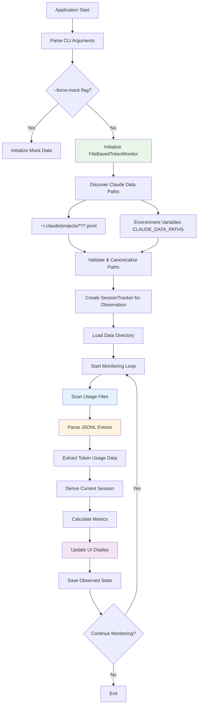

# Claude Token Monitor - File-Based Edition

🧠 **v0.2.4** - A lightweight, high-performance Rust tool for monitoring Claude AI token usage by reading local files created by Claude Code.

## Features

- 📁 **File-based monitoring** - No API keys or authentication required
- 🔍 **Passive observation** - Reads Claude Code's JSONL usage files
- 📊 **Enhanced Ratatui UI** with 7 interactive tabs and visual progress bars
- 🤖 **Smart predictions** for token depletion timing based on observed usage
- 📈 **Usage analytics** and efficiency scoring from real usage data
- 🔄 **Session observation** with persistent storage of observed sessions
- ⚡ **Lightning fast** - built with Rust for performance and memory safety
- 🛠️ **Configurable** plans and thresholds
- 📱 **Cross-platform** support (Linux, macOS, Windows)
- 🔒 **Privacy-focused** - All processing happens locally, no network connections
- 🕐 **Human-friendly time formatting** using humantime library
- ⚙️ **Real-time file watching** for automatic updates when Claude Code writes new data

## How It Works

This tool monitors your Claude AI token usage by **passively reading local files** that Claude Code writes during your conversations. It requires **no API calls, authentication, or network access** - everything happens locally by observing the usage data Claude Code already creates.

### What Files It Monitors

- `~/.claude/projects/**/*.jsonl` (primary location)
- `~/.config/claude/projects/**/*.jsonl` (alternative location)  
- Custom paths from `CLAUDE_DATA_PATHS` or `CLAUDE_DATA_PATH` environment variables

### What Data It Reads

- Token usage counts (input, output, cache tokens)
- Timestamps of each Claude interaction
- Model information and session identifiers
- Request and message IDs (for deduplication)

The tool **never reads conversation content** - only the token usage metadata that Claude Code logs.

## Installation

### Prerequisites

1. **Claude Code** must be installed and configured
2. **Rust** toolchain (if building from source)

### From Source

1. Install Rust (if not already installed):
```bash
curl --proto '=https' --tlsv1.2 -sSf https://sh.rustup.rs | sh
```

2. Clone and build:
```bash
git clone https://github.com/teamktown/claude-token-monitor
cd claude-token-monitor
cargo build --release
```

3. Install globally:
```bash
cargo install --path .
```

## Usage

### Quick Start

1. **Use Claude Code** to have a conversation (this creates the usage files)
2. **Start monitoring** with enhanced Ratatui interface:
```bash
claude-token-monitor
```

For basic terminal UI:
```bash
claude-token-monitor --basic-ui
```

For development/testing with mock data:
```bash
claude-token-monitor --force-mock
```

### Commands

#### Monitor in Real-time (Passive Observation)
```bash
# Start monitoring with Pro plan (uses Ratatui interface by default)
claude-token-monitor monitor --plan pro

# Monitor with custom update interval  
claude-token-monitor monitor --plan max5 --interval 5

# Use basic terminal UI instead of Ratatui
claude-token-monitor monitor --basic-ui

# Default monitoring (same as 'monitor' command)
claude-token-monitor
```

#### Session Observation (Read-Only)
```bash
# Check observed session status from JSONL files
claude-token-monitor status

# View observed session history
claude-token-monitor history --limit 20
```

#### Configuration
```bash
# Set default plan hint for calculations
claude-token-monitor config --plan max20

# Set update interval for file scanning
claude-token-monitor config --interval 2

# Set warning threshold (85% = 0.85)
claude-token-monitor config --threshold 0.9
```

#### Information and Help
```bash
# Get detailed explanation of how the tool works
claude-token-monitor --explain-how-this-works

# Show version and author information
claude-token-monitor --about

# Get help with all commands
claude-token-monitor --help
```

### Plan Types

- **pro**: 40,000 tokens per 5-hour session
- **max5**: 20,000 tokens per 5-hour session  
- **max20**: 100,000 tokens per 5-hour session
- **custom**: Specify custom token limit (e.g., `--plan 50000`)

## Enhanced Ratatui Interface

The enhanced interface provides 7 interactive tabs with comprehensive monitoring:

### Tab 0: Overview
- Real-time observed session information with status indicators
- Token usage gauge with color-coded warnings
- Current usage statistics table (rate, progress, efficiency)
- Session predictions and recommendations

### Tab 1: Charts  
- Token usage distribution (used vs remaining) with horizontal bar charts
- Usage history visualization with time-based progression
- Visual representation of token consumption patterns

### Tab 2: Session
- Detailed observed session information (ID, plan, dates)
- Session predictions with depletion timing
- Usage efficiency recommendations based on patterns

### Tab 3: Details (Interactive)
- Navigable detail categories with drill-down capability
- Token breakdown, usage rate analysis, session timeline
- Cache token details, model information, file sources
- Performance metrics and recent activity summaries

### Tab 4: Security
- Security recommendations and analysis
- Memory safety, input validation, and resource protection status
- Information security and build security features

### Tab 5: Settings
- Current configuration display
- Technical details about passive monitoring data flow
- File operation explanations and calculation formulas

### Tab 6: About
- Author and version information
- Usage tips and Claude Code integration details
- Attribution and build information

**Navigation:**
- `Tab` / `Shift+Tab`: Switch between tabs
- `q` / `Esc` / `Ctrl+C`: Quit application  
- `r`: Refresh data (rescans files)
- `↑↓`: Scroll within tabs
- `←→`: Navigate details (Tab 3 only)

## File Discovery and Configuration

### Automatic File Discovery

The monitor automatically discovers Claude Code usage files from these locations:

```bash
# Primary location (most common)
~/.claude/projects/**/*.jsonl

# Alternative location  
~/.config/claude/projects/**/*.jsonl
```

### Custom Paths

You can specify custom paths using environment variables:

```bash
# Multiple paths (colon-separated)
export CLAUDE_DATA_PATHS="/path/to/claude/data:/another/path"

# Single path
export CLAUDE_DATA_PATH="/custom/claude/data"
```

### Security and Validation

All file paths are automatically:
- **Validated** for security (no path traversal, null bytes, etc.)
- **Canonicalized** to resolve symlinks and normalize paths  
- **Bounded** to safe directories (home directory or allowed system paths)
- **Size-limited** to prevent resource exhaustion (50MB max per file)

## Configuration

Configuration is stored in:
- Linux: `~/.local/share/claude-token-monitor/config.json`
- macOS: `~/Library/Application Support/claude-token-monitor/config.json`
- Windows: `%APPDATA%\claude-token-monitor\config.json`

Example configuration:
```json
{
  "default_plan": "Pro",
  "timezone": "UTC",
  "update_interval_seconds": 3,
  "warning_threshold": 0.85,
  "auto_switch_plans": true,
  "color_scheme": {
    "progress_bar_full": "green",
    "progress_bar_empty": "gray",
    "warning_color": "yellow",
    "success_color": "green",
    "error_color": "red",
    "info_color": "blue"
  }
}
```

## Architecture

The tool is built with a modular, file-based monitoring architecture:

```
src/
├── main.rs              # CLI interface and command handling
├── lib.rs               # Library exports
├── models/
│   └── mod.rs          # Data structures (TokenSession, UsageMetrics, etc.)
├── services/
│   ├── mod.rs          # Service traits and interfaces  
│   ├── session_tracker.rs   # Session observation and persistence
│   ├── token_monitor.rs     # Real-time monitoring logic
│   └── file_monitor.rs      # File-based JSONL parsing and analysis
└── ui/
    ├── mod.rs          # Basic terminal UI interface
    └── ratatui_ui.rs   # Enhanced 7-tab Ratatui interface
```

### Key Design Principles

- **Passive Monitoring**: Only reads existing files, never writes to Claude Code data
- **No Network Access**: Everything happens locally, no API calls required
- **Security First**: Comprehensive input validation and memory safety
- **Real-time Updates**: File system watching for immediate updates
- **Privacy Focused**: No conversation content access, only token metadata

## System Flow

The application follows a file-based passive monitoring flow:



For detailed technical flow diagrams, see [docs/system-flow.md](docs/system-flow.md).

### Key Components

- **TokenSession**: Represents an observed Claude usage session with metadata
- **SessionTracker**: Observes and persists session data from JSONL files
- **FileBasedTokenMonitor**: Scans and parses Claude Code's JSONL usage files
- **TokenMonitor**: Real-time monitoring with async file watching
- **RatatuiTerminalUI**: Enhanced 7-tab interface with interactive navigation
- **UsageEntry**: Represents individual token usage events from JSONL data

## Performance

Built with Rust for maximum performance:
- **Memory efficient**: Minimal memory footprint
- **Fast startup**: Sub-second initialization
- **Concurrent**: Async/await for non-blocking operations
- **Cross-platform**: Works on Linux, macOS, and Windows
- **Real-time updates**: Efficient polling with configurable intervals

## Development

### Building

```bash
cargo build
```

### Testing

```bash
cargo test
```

### Linting

```bash
cargo clippy
```

### Formatting

```bash
cargo fmt
```

### Check compilation

```bash
cargo check
```

## File Monitoring Features

The monitor includes comprehensive file-based monitoring with:

- **Real-time file watching** using the notify crate for instant updates
- **JSONL parsing** with security limits (1MB per line, 32 levels max depth)
- **Automatic deduplication** based on message IDs and request IDs
- **Session derivation** from usage patterns (5-hour windows)
- **Multi-path support** for different Claude Code installation locations

## Mock Mode

For development and testing when no Claude Code data is available:
```bash
claude-token-monitor --force-mock
```

This generates realistic simulated usage data for development purposes. The application no longer automatically falls back to mock mode - it must be explicitly enabled.

## Contributing

1. Fork the repository
2. Create a feature branch
3. Make your changes
4. Add tests for new functionality
5. Run `cargo test` and `cargo clippy`
6. Submit a pull request

## License

MIT License - see LICENSE file for details.

## Changelog

### v0.2.4 (Current)
- 📁 **File-based monitoring architecture** - Complete rewrite for passive observation
- 🔍 **JSONL file parsing** - Reads Claude Code's usage files directly
- 🛡️ **Security hardening** - Comprehensive input validation and memory safety
- 📊 **7-tab Ratatui interface** - Overview, Charts, Session, Details, Security, Settings, About
- ⚡ **Real-time file watching** - Automatic updates when Claude Code writes new data
- 🔒 **Privacy-focused design** - No network access, all processing local
- 📋 **Session observation** - Derives sessions from usage patterns rather than API calls
- 🎯 **Accurate calculations** - Usage rates, efficiency scores, and depletion predictions

### v0.2.3
- 🔧 Removed automatic fallback to mock mode (now requires --force-mock)
- 📋 Enhanced Settings tab with comprehensive technical documentation
- 📊 Added detailed system flow diagrams and architecture documentation
- 🔍 Improved error messages with actionable guidance for file discovery
- 💡 Added "How It Works" section explaining passive monitoring approach
- 📚 Created docs/system-flow.md with complete technical diagrams

### v0.2.0-0.2.2
- ✨ Enhanced Ratatui interface with tabbed navigation
- 🕐 Human-friendly time formatting with humantime library
- 📊 Interactive horizontal bar charts and gauges
- 🎨 Professional UI with color coding and real-time updates
- 🔧 Improved CLI argument structure (--basic-ui flag)
- 📈 Enhanced session analytics and predictions
- 🛠️ Better error handling and file discovery

### v0.1.0
- 🚀 Initial release with basic monitoring
- 📊 Simple terminal UI with progress bars
- 🔄 Session management and persistence
- 🤖 Token usage predictions

## Acknowledgments

- Inspired by [Claude-Code-Usage-Monitor](https://github.com/Maciek-roboblog/Claude-Code-Usage-Monitor)
- Built with Ratatui for enhanced terminal interfaces
- Powered by Rust and tokio for high performance
- Humantime library for user-friendly time formatting

---

**Author:** Chris Phillips <tools-claude-token-monitor@adiuco.com>  
**Version:** 0.2.4  
**License:** MIT  
**Repository:** https://github.com/teamktown/claude-token-monitor

**⚠️ Important:** This tool requires Claude Code to be installed and used first to generate the JSONL usage files it monitors. It's a passive monitoring tool that reads existing data, not a replacement for Claude Code itself.