# Claude Token Monitor - Rust Edition

🧠 **v0.2.1** - A lightweight, high-performance Rust client for monitoring Claude AI token usage with enhanced Ratatui terminal interface.

## Features

- 🔥 **Real-time monitoring** with customizable update intervals
- 📊 **Enhanced Ratatui UI** with interactive tabs and visual progress bars
- 🤖 **Smart predictions** for token depletion timing
- 📈 **Usage analytics** and efficiency scoring
- 🔄 **Session management** with persistent storage
- ⚡ **Lightning fast** - built with Rust for performance
- 🛠️ **Configurable** plans and thresholds
- 📱 **Cross-platform** support (Linux, macOS, Windows)
- 🔑 **OAuth Integration** - Supports ~/.claude/.credentials.json
- 🕐 **Human-friendly time formatting** using humantime library

## Installation

### From Source

1. Install Rust (if not already installed):
```bash
curl --proto '=https' --tlsv1.2 -sSf https://sh.rustup.rs | sh
```

2. Clone and build:
```bash
git clone https://github.com/teamktown/claude-token-monitor
cd claude-token-monitor
cargo build --release
```

3. Install globally:
```bash
cargo install --path .
```

## Usage

### Quick Start

Start monitoring with enhanced Ratatui interface (default):
```bash
claude-token-monitor
```

Use basic terminal UI:
```bash
claude-token-monitor --basic-ui
```

### Commands

#### Monitor in Real-time
```bash
# Start monitoring with Pro plan (uses Ratatui interface by default)
claude-token-monitor monitor --plan pro

# Monitor with custom update interval
claude-token-monitor monitor --plan max5 --interval 5

# Use basic terminal UI instead of Ratatui
claude-token-monitor monitor --basic-ui
```

#### Session Management
```bash
# Create a new session
claude-token-monitor create --plan pro

# Check current session status
claude-token-monitor status

# End current session
claude-token-monitor end

# View session history
claude-token-monitor history --limit 20
```

#### Configuration
```bash
# Set default plan
claude-token-monitor config --plan max20

# Set update interval
claude-token-monitor config --interval 2

# Set warning threshold (85% = 0.85)
claude-token-monitor config --threshold 0.9
```

#### Authentication
```bash
# Check authentication status
claude-token-monitor auth status

# Validate credentials
claude-token-monitor auth validate

# Get help with authentication
claude-token-monitor auth help
```

### Plan Types

- **pro**: 40,000 tokens per 5-hour session
- **max5**: 20,000 tokens per 5-hour session  
- **max20**: 100,000 tokens per 5-hour session
- **custom**: Specify custom token limit (e.g., `--plan 50000`)

## Enhanced Ratatui Interface

The new enhanced interface provides tabbed navigation:

### Tab 1: Overview
- Real-time token usage with horizontal bar chart
- Session progress gauge
- Current usage statistics
- Predictions and recommendations

### Tab 2: Session Details
- Session ID and metadata
- Plan type and limits
- Start time and reset time (human-readable format)
- Status indicator

### Tab 3: Analytics
- Usage rate metrics
- Efficiency scoring
- Projected depletion time
- Historical usage patterns

### Tab 4: Help
- Keyboard shortcuts
- Available commands
- Configuration options

**Navigation:**
- `Tab` / `Shift+Tab`: Switch between tabs
- `q` / `Ctrl+C`: Quit application
- `r`: Refresh data
- `h`: Show help

## Authentication

### Claude CLI Integration

The monitor automatically detects and uses Claude CLI credentials from:
```
~/.claude/.credentials.json
```

### Environment Variables

You can also set:
```bash
export CLAUDE_API_KEY="your-api-key-here"
```

### Command Line

Pass API key directly:
```bash
claude-token-monitor --api-key "your-api-key-here"
```

The application will check credential sources in this order:
1. Command line `--api-key` flag
2. Claude CLI credentials file
3. Environment variables

## Configuration

Configuration is stored in:
- Linux: `~/.local/share/claude-token-monitor/config.json`
- macOS: `~/Library/Application Support/claude-token-monitor/config.json`
- Windows: `%APPDATA%\claude-token-monitor\config.json`

Example configuration:
```json
{
  "default_plan": "Pro",
  "timezone": "UTC",
  "update_interval_seconds": 3,
  "warning_threshold": 0.85,
  "auto_switch_plans": true,
  "color_scheme": {
    "progress_bar_full": "green",
    "progress_bar_empty": "gray",
    "warning_color": "yellow",
    "success_color": "green",
    "error_color": "red",
    "info_color": "blue"
  }
}
```

## Architecture

The client is built with a modular architecture:

```
src/
├── main.rs              # CLI interface and command handling
├── lib.rs               # Library exports
├── models/
│   ├── mod.rs          # Data structures (TokenSession, UsageMetrics, etc.)
│   ├── api.rs          # API response models
│   └── credentials.rs  # OAuth credential management
├── services/
│   ├── mod.rs          # Service traits and interfaces
│   ├── session_tracker.rs  # Session management and persistence
│   ├── token_monitor.rs     # Real-time monitoring logic
│   └── api_client.rs        # Claude API client with OAuth
├── ui/
│   ├── mod.rs          # Basic terminal UI
│   └── ratatui_ui.rs   # Enhanced Ratatui interface
└── commands/
    └── auth.rs         # Authentication commands
```

## System Flow

The application follows a structured data flow from startup to monitoring:

```mermaid
flowchart TD
    A[Application Start] --> B[Parse CLI Arguments]
    B --> C{--force-mock flag?}
    C -->|Yes| D[Initialize Mock TokenMonitor]
    C -->|No| E[Check Credentials]
    
    E --> F[Try CLI Args --api-key]
    F --> G{API Key Found?}
    G -->|Yes| H[Create ApiClient]
    G -->|No| I[Try ~/.claude/.credentials.json]
    I --> J{Credentials Found?}
    J -->|Yes| H
    J -->|No| K[Try Environment Variables]
    K --> L{CLAUDE_API_KEY set?}
    L -->|Yes| H
    L -->|No| M[❌ Exit with Error]
    
    H --> N[Test API Connection]
    N --> O{Connection OK?}
    O -->|Yes| P[Create Real TokenMonitor]
    O -->|No| M
    
    D --> Q[Load Data Directory]
    P --> Q
    Q --> R[SessionTracker loads sessions.json]
    R --> S[Start Monitoring Loop]
    S --> T[Fetch Current Token Usage]
    T --> U[Calculate Metrics]
    U --> V[Update UI]
    V --> W[Save Session State]
    W --> X{Continue?}
    X -->|Yes| S
    X -->|No| Y[Exit]
```



For detailed technical flow diagrams, see [docs/system-flow.md](docs/system-flow.md).

### Key Components

- **TokenSession**: Represents a Claude usage session with metadata
- **SessionTracker**: Manages session lifecycle and persistence
- **TokenMonitor**: Real-time monitoring with async updates
- **RatatuiTerminalUI**: Enhanced tabbed interface with interactive elements
- **ApiClient**: OAuth-enabled Claude API client
- **CredentialManager**: Handles multiple credential sources

## Performance

Built with Rust for maximum performance:
- **Memory efficient**: Minimal memory footprint
- **Fast startup**: Sub-second initialization
- **Concurrent**: Async/await for non-blocking operations
- **Cross-platform**: Works on Linux, macOS, and Windows
- **Real-time updates**: Efficient polling with configurable intervals

## Development

### Building

```bash
cargo build
```

### Testing

```bash
cargo test
```

### Linting

```bash
cargo clippy
```

### Formatting

```bash
cargo fmt
```

### Check compilation

```bash
cargo check
```

## API Integration

The monitor now includes full Claude API integration with:

- **OAuth credentials** support
- **Retry logic** with exponential backoff
- **Rate limiting** awareness
- **Error handling** for API failures
- **Connection testing** on startup

## Mock Mode

For development and testing only:
```bash
claude-token-monitor --force-mock
```

This forces the use of simulated data instead of real API calls. The application will no longer automatically fallback to mock mode if API connection fails.

## Contributing

1. Fork the repository
2. Create a feature branch
3. Make your changes
4. Add tests for new functionality
5. Run `cargo test` and `cargo clippy`
6. Submit a pull request

## License

MIT License - see LICENSE file for details.

## Changelog

### v0.2.1
- 🔧 Removed automatic fallback to mock mode (now requires --force-mock)
- 📋 Enhanced Settings tab with comprehensive technical documentation
- 📊 Added detailed system flow diagrams and architecture documentation
- 🔍 Improved error messages with actionable guidance for credential setup
- 💡 Added "How It Works" section explaining real code flow and calculations
- 📚 Created docs/system-flow.md with complete technical diagrams

### v0.2.0
- ✨ Enhanced Ratatui interface with tabbed navigation
- 🔑 OAuth integration with Claude CLI credentials
- 🕐 Human-friendly time formatting with humantime library
- 📊 Interactive horizontal bar charts and gauges
- 🎨 Professional UI with color coding and real-time updates
- 🔧 Improved CLI argument structure (--basic-ui flag)
- 📈 Enhanced session analytics and predictions
- 🛠️ Better error handling and connection testing

### v0.1.0
- 🚀 Initial release with basic monitoring
- 📊 Simple terminal UI with progress bars
- 🔄 Session management and persistence
- 🤖 Token usage predictions

## Acknowledgments

- Inspired by [Claude-Code-Usage-Monitor](https://github.com/Maciek-roboblog/Claude-Code-Usage-Monitor)
- Built with Ratatui for enhanced terminal interfaces
- Powered by Rust and tokio for high performance
- Humantime library for user-friendly time formatting

---

**Author:** Chris Phillips <chris@adiuco.com>  
**Version:** 0.2.4  
**License:** MIT