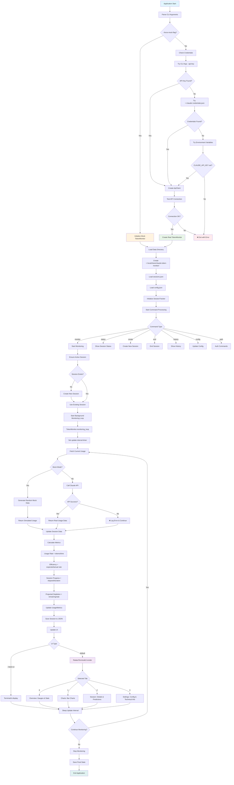

# Claude Token Monitor - System Flow

## Application Data Flow



## File Operations Flow

```mermaid
flowchart LR
    A[Session Data] --> B[~/.local/share/claude-token-monitor/]
    B --> C[sessions.json]
    B --> D[config.json]
    
    E[Credentials] --> F[CLI --api-key]
    E --> G[~/.claude/.credentials.json]
    E --> H[CLAUDE_API_KEY env var]
    
    I[API Client] --> J[fetch_token_usage()]
    J --> K{Mode}
    K -->|Real| L[POST https://api.anthropic.com/v1/messages]
    K -->|Mock| M[Generate Random 1500-1600]
    
    L --> N[Parse API Response]
    M --> O[Return Mock Data]
    N --> P[Extract session_usage]
    O --> P
    P --> Q[Update TokenSession.tokens_used]
    Q --> R[Calculate Metrics]
    R --> S[Save to sessions.json]
    
    style C fill:#e3f2fd
    style D fill:#e8f5e8
    style G fill:#fff3e0
    style L fill:#fce4ec
    style M fill:#fff8e1
```

## Calculation Details

### Usage Rate Calculation
```
usage_rate = (current_tokens - start_tokens) / time_elapsed_minutes
```

### Efficiency Score Calculation
```
expected_rate = total_session_duration / session_progress
actual_rate = current_usage_rate
efficiency = min(1.0, max(0.0, expected_rate / actual_rate))
```

### Projected Depletion
```
remaining_tokens = token_limit - current_tokens
time_to_depletion = remaining_tokens / usage_rate
depletion_time = current_time + time_to_depletion
```

### Session Progress
```
elapsed_time = current_time - session_start_time
session_duration = 5 hours (18000 seconds)
progress = elapsed_time / session_duration
```

## Data Persistence

### Session Storage (sessions.json)
```json
[
  {
    "id": "uuid-v4",
    "plan_type": "Pro",
    "tokens_used": 15420,
    "tokens_limit": 40000,
    "start_time": "2025-07-08T18:30:00Z",
    "reset_time": "2025-07-08T23:30:00Z",
    "is_active": true,
    "created_at": "2025-07-08T18:30:00Z",
    "updated_at": "2025-07-08T19:15:00Z"
  }
]
```

### Configuration (config.json)
```json
{
  "default_plan": "Pro",
  "timezone": "UTC",
  "update_interval_seconds": 3,
  "warning_threshold": 0.85,
  "auto_switch_plans": true,
  "color_scheme": {
    "progress_bar_full": "green",
    "progress_bar_empty": "gray",
    "warning_color": "yellow",
    "success_color": "green",
    "error_color": "red",
    "info_color": "blue"
  }
}
```

### Claude CLI Credentials (~/.claude/.credentials.json)
```json
{
  "access_token": "oauth-access-token",
  "refresh_token": "oauth-refresh-token",
  "expires_at": "2025-07-15T18:30:00Z",
  "token_type": "Bearer"
}
```